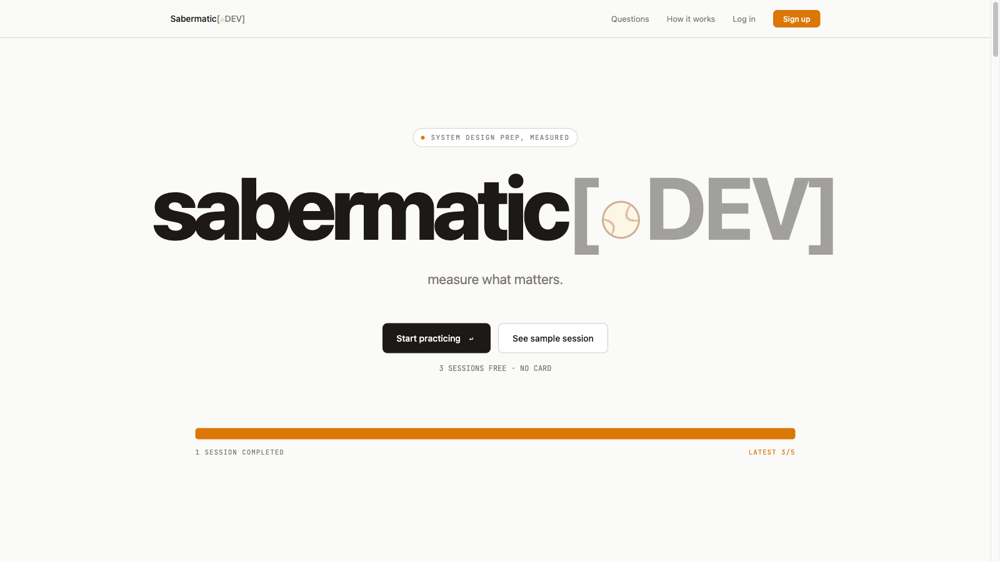
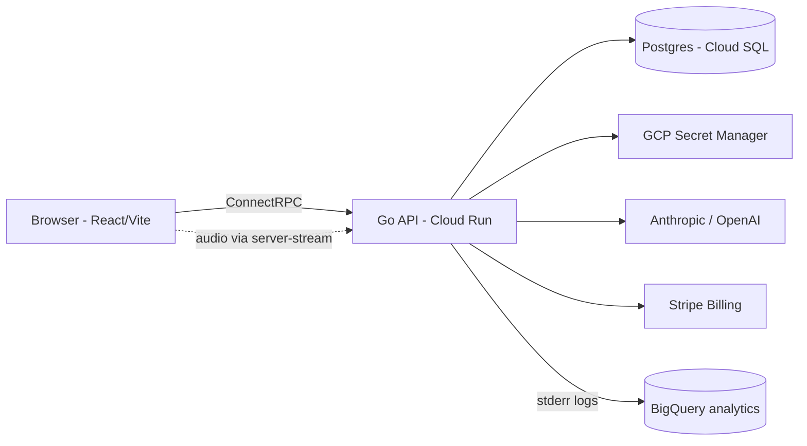

# Sabermatic

> System-design interview practice with an AI coach. Voice-driven, real-time, structured feedback.

[](https://github.com/btc/sabermatic.dev/actions/workflows/ci.yml)
[](LICENSE.md)
[](go.mod)



**Try it:** [sabermatic.dev](https://sabermatic.dev)

> This repo's git slug is `drill` (project codename); the product is Sabermatic.

## License

Sabermatic is released under the [Functional Source License, Version 1.1, Apache 2.0 Future License](LICENSE.md). You may read, fork, run, modify, and learn from the code. You may not run it as a competing service. This release converts to Apache 2.0 on 2028-05-05; subsequent releases convert two years after their publication.

## Why this exists

Sabermatic was built end-to-end with [Claude Code](https://docs.claude.com/claude-code) over ~6 weeks. The `docs/superpowers/specs/` and `docs/superpowers/plans/` directories show every feature's spec → plan → implementation cycle in real use. `CLAUDE.md` documents the project's engineering conventions. Source-available because we want the workflow and the code to be readable, but not trivially clonable as a competing service.

## Architecture



- **Backend:** Go 1.25, ConnectRPC, sqlc, River jobs, Postgres 16, OpenTelemetry.
- **Frontend:** React 19, Vite, Tailwind, ConnectRPC client.
- **Infra:** GCP Cloud Run, Cloud SQL, Secret Manager, Artifact Registry, BigQuery. Terraform-managed.
- **Billing:** Stripe (subscriptions + minute packs).

## Repository layout

| Path | Purpose |
|---|---|
| `internal/` | Backend Go code (handlers, services, jobs, db, billing). |
| `cmd/` | Binaries (`drill`, `drillctl`, `stripescenario`). |
| `web/` | React frontend. |
| `pb/` | Protobuf source (`.proto`); generated code in `internal/pb/` and `web/src/pb/`. |
| `sql/` | Database migrations and sqlc queries. |
| `terraform/` | GCP infrastructure as code. |
| `docs/` | Engineering specs, plans, and reference docs. |
| `CLAUDE.md` | Conventions for AI-assisted development in this repo. |

## Running locally

### Prerequisites

- Go 1.25 (see `go.mod`)
- Node 22 (see `.nvmrc`)
- Postgres 16
- (Optional) Docker, for ancillary services

### Quickstart

```bash
git clone https://github.com/btc/sabermatic.dev.git
cd drill
cp .env.example .env
# Populate .env per the comments inside it
make dev
```

`make dev` starts the Vite dev server and the Go backend (with hot reload via `air`) on port `:8080`.

See `.env.example` for every key the backend reads. Some keys are only needed for specific features:

- **LLM features** require `ANTHROPIC_API_KEY` (and optionally `OPENAI_API_KEY`).
- **Stripe billing** requires the `STRIPE_*` keys plus `make stripe-setup` to populate `STRIPE_WEBHOOK_SECRET`.
- **GCP Secret Manager** is a no-op locally; the backend reads from `.env` instead.
- **BigQuery analytics** (event sink) requires a deployed environment.
- **OAuth (Google, GitHub)** requires registered client IDs/secrets.

## Testing

```bash
make test
```

Runs: `buf lint`, codegen check, `go test ./internal/... ./cmd/... -race -count=1`, `golangci-lint`, frontend `tsc --noEmit -p tsconfig.app.json`, ESLint, Vitest. CI runs the same target.

## Deployment

See `terraform/` for the GCP infrastructure that backs production. `scripts/deploy.sh` triggers a Cloud Run deploy.

## Contributing

Sabermatic is source-available, not open source. We are not currently accepting outside pull requests, but bug reports via Issues are welcome.
